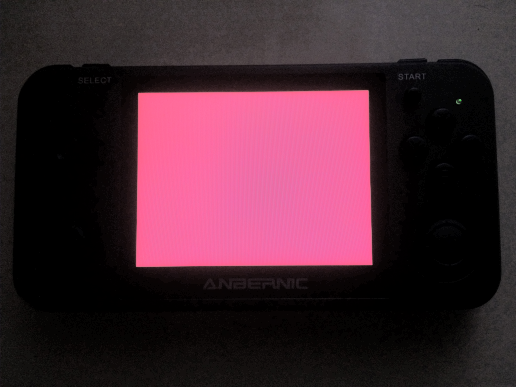

# What? Why?

I got my hands on a RG350M - a portable, MIPS32, Linux based handheld portable using the
[OpenDingux](https://wiki.dingoonity.org/index.php?title=OpenDingux:About) distribution - for
the purpouse of low-spec handheld Rust game development without signing a bunch of NDAs.

# Quick Start

1.  Install [rustup] on Linux (Windows WSL OK)
2.  Install [VS Code](https://code.visualstudio.com/)
3.  Open this directory in VS Code
4.  Optionally install workspace recommended VS Code extensions
5.  Run the `default` build task (`Ctrl`+`Shift`+`B`). 
    <b>May require `sudo` password on first run</b> (to auto-install dependencies)
6.  Copy `target/package.opk` into your device SD card's `APPS` folder
7.  See the launcher icons in the new `rust` category
8.  Profit!

## Installed Dependencies

* <code>/opt/gcw0-toolchain</code> from http://www.gcw-zero.com/files/opendingux-gcw0-toolchain.2014-08-20.tar.bz2
* <code>rustup toolchain install <u>nightly-2020-06-15</u> --component <u>rust-src</u> --profile=minimal</code>
* <code>cargo install [xargo] --version "^0.3"</code>

## License

Licensed under either of

* Apache License, Version 2.0 ([LICENSE-APACHE](LICENSE-APACHE) or http://www.apache.org/licenses/LICENSE-2.0)
* MIT license ([LICENSE-MIT](LICENSE-MIT) or http://opensource.org/licenses/MIT)

at your option.

## Contribution

Unless you explicitly state otherwise, any contribution intentionally submitted
for inclusion in the work by you, as defined in the Apache-2.0 license, shall be
dual licensed as above, without any additional terms or conditions.

# Takeaways

* `egl` is unsound as heck and unmaintained
* `khronos-egl` 's pkg_config isn't cross compilation friendly
* `egli` for the win?

[rustup]:       https://rustup.rs/
[xargo]:        https://github.com/japaric/xargo
